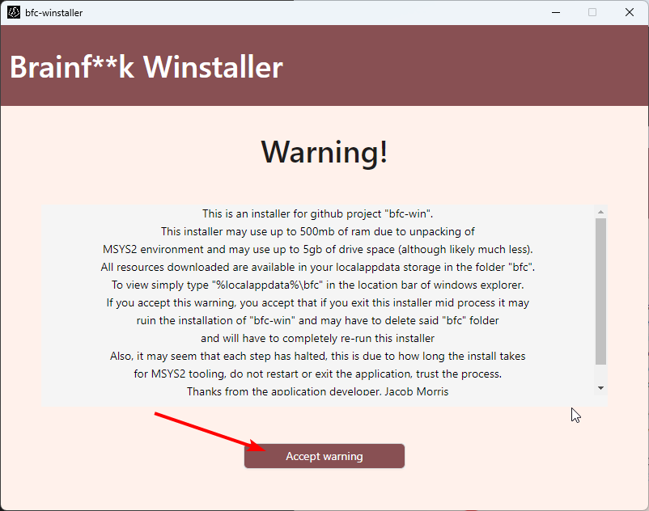
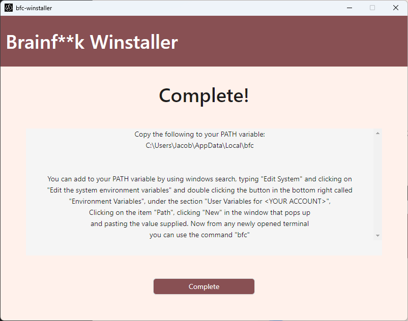

### How to install Brainf**k Compiler using bfc-winstaller
1. Go to the [releases page](https://github.com/bfcompiler/bfc-winstaller/releases/) of bfc-winstaller on github
![[images/install/dp.png]]
2. Download either bfc-winstaller.exe or bfc-winstaller.zip
![[images/install/di.png]]
3. If zip was chosen, unzip to get bfc-winstaller.exe
![[images/install/uz.png]]
4. Launch bfc-winstaller.exe
![[images/install/op.png]]
5. Accept the MIT License
![[images/install/ac.png]]
6. Accpet installation warning (Please read the warning!)

7. Wait for the environment to be created
![[images/install/wa.png]]
8. Wait for Brainf\*\*k Compiler to download
![[images/install/bd.png]]
9. [Add %localappdata%\\bfc to your user path variable](Path)

## [Done!](README)